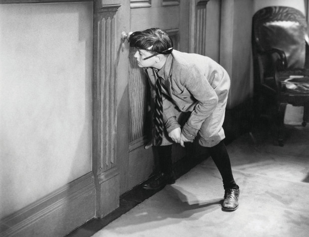

# _Performative Acts and Gender Constitution: An Essay in Phenomenology and Feminist Theory_  by Judith Butler (1988)

The below contains an introductory, high-level overview of Judith Butler's idea of gender performativity.

If you would like to read and understand the original essay, I created a painstakingly thorough [notated PDF of Butler's essay](butler_performative-acts-and-gender-constitution_notes_alexandria-rohn.pdf).

## Context

#### Judith Butler

- Judith Butler (1956–) is a prominent American philosopher and feminist theorist.
- They are best known for their books _Gender Trouble_ (1990), as well as _Bodies That Matter_ (1993) and _Undoing Gender_ (2004), which explore and theorize on gender, identity, language, and power.

#### 1988 Context and Influence

- Presumed universal woman
	- Second-wave feminism (1960s-1980s) had made political strides. However, it faced criticism for assuming a universal "woman", often white and middle-class, that did not account for differences in race, class, or sexuality.
- Post-Structuralism
	- Butler was heavily influenced by post-structuralist thinkers such as Michel Foucault. 
	- They argued that meaning is unstable, fragmented, and shifting.
	- Power and knowledge are not fixed or inherent but created through discourse and social practices.
- AIDS crisis and queer politics:
	- The AIDS epidemic, emerging in the early 1980s, had devastated and brought increased scrutiny of the LGBT community.
	- Queer theory began to emerge as a challenge to mainstream feminism and LGBT activism, seeking to question the categories of "gay" and "straight."

#### Main thesis

- Gender is not a stable, innate identity but a performative act— socially constructed through repeated behaviors, gestures, and speech acts.
- These acts are historically and culturally situated, regulated by social norms and punishment.
	- This serves to obscure gender's performativity and makes it seem like a natural, fixed essence.
- Gender's performativity opens up gender norms to be transformed and subverted by performing gender in different ways.

## Introduction

#### Speech act theory and performativity

- Developed by 20th century philosophers J.L. Austin, John Searle, and others.
- Performativity is used as a technical term here, not in the colloquial sense of a theatrical or exaggerated performance.
- Performative statements bring about a new state of affairs by their very utterance.
- For example, "I promise" creates the commitment to do something. Whereas saying, "It's raining outside," merely describes the state of things.
- Or, "I now pronounce you married," formally brings about that declaration.

#### Phenomenology

- Developed by 20th century philosophers Edmund Husserl, Maurice Merleau-Ponty, and others.
- Phenomenology describes and analyzes lived experience.
- The self is something we _do_ rather than something we _are_. i.e. Our identity is constructed rather than something innate and fixed.
- The body is a lived, intentional presence in the world. The body isn't a mere object; we _live through our bodies_.
- Reacting against the long-standing tradition of mind-body dualism.
	- Dualism sees a split between mind and body, with the mind being the seat of consciousness and the body being a mere mechanical object.

- Imagine someone engrossed in secretly peering through a keyhole. They are just a subject perceiving the world. Suddenly, they hear footsteps behind them and become aware of being perceived by someone else. In this moment, they become aware of their embodiment and how it's an object in the world, revealing the complicated relationship between mind and body.

#### Merleau-Ponty and the Body as an Historical Idea

- The body is a **historical idea**, shaped by history and culture, not a mere passive biological entity.
- For example, women have been traditionally taught to take up less space with their bodies, maintaining a "ladylike" posture. However, this is the result of social and historical forces, not some innate preferences.

#### Simone de Beauvoir

- "one is not born, but rather, becomes a woman."
	- Our gender identity isn't some pre-existing essence. Rather, we become a gender via constituting acts. i.e. Gender is socially constructed.

## Butler's Synthesis

- Butler synthesizes speech act theory and phenomenology to describe how embodiment itself (dress, gait, posture, etc.) can be performative.
- Butler draws on speech act theory to support the idea that gender is not something innate but something brought into being through repeated performances.
- Butler looks to phenomenology to explain how the body is the site where gender is lived and experienced, performing it through the body.
- From the body as an historical idea, Butler posits that gendered behavior is similarly historically shaped.
- And Butler extends de Beauvoir's idea of gender as socially constructed to show that it's continually constructed through performative acts.

